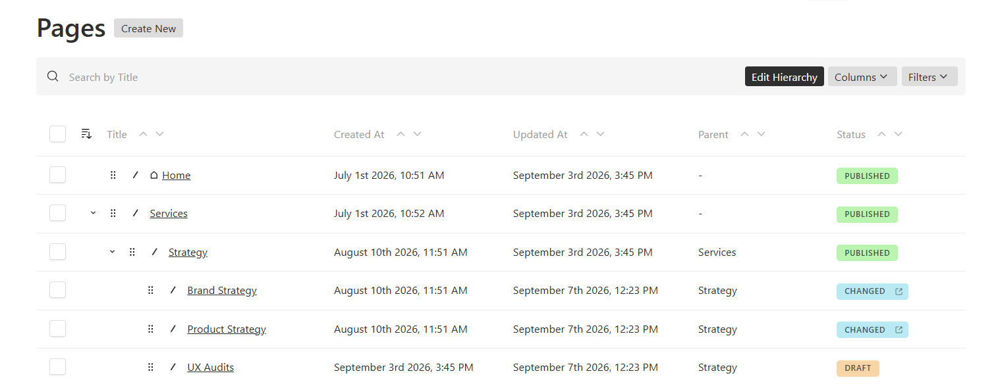
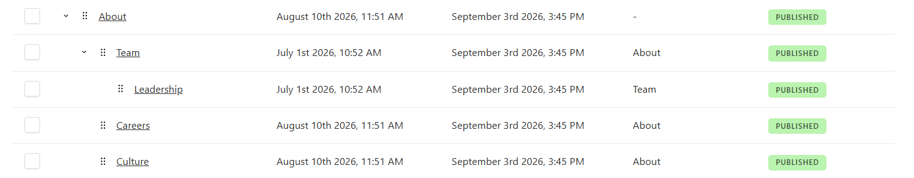

# payload-nested-docs-page-tree

Page management tools for Payload admin, built on [`@payloadcms/plugin-nested-docs`](https://payloadcms.com/docs/plugins/nested-docs).

- **Page tree UI** with hierarchy and page URL paths.
- **Intuitive drag and drop** to reorder siblings or move pages between parents.
- **Status badges** for published pages, drafts, and drafts with unpublished changes.
- **Live and preview links** from badges, with separate destinations for changed pages.
- **Customizable badges** with label and color overrides for light and dark themes.
- **Homepage icon** to identify the root `home` page.
- **Publishing controls** to stage hierarchy changes or publish eligible moves immediately.
- **Diagnostics mode** to trace moves, reorders, and published-state changes.
- **Native list tools** including sorting, filters, pagination, bulk selection, and row actions.

**Coming soon:** custom badges for any cell.

[Page tree](#page-tree-ui) · [Drag and drop](#drag-and-drop) · [Badges](#badges) · [Live and preview links](#live-and-preview-links) · [Homepage icon](#homepage-icon) · [Diagnostics](#diagnostics) · [Full setup](#setup) · [Configuration](#configuration)

## Page tree UI



Browse nested pages while keeping Payload's sorting, filters, pagination, bulk selection, and row actions.

### Visual hierarchy



### Page URL paths


## Drag and drop

### Reorder siblings

https://github.com/user-attachments/assets/b25ffa1a-a6bd-45cf-bce8-56ba6cdf7e72

Requires Payload `orderable` and sorting by its order field. Drag the reorder handle within the same parent or root level; only the order key changes.

### Edit hierarchy

https://github.com/user-attachments/assets/618d5e53-5918-40be-9932-0f516e5e82ba

Enable **Edit Hierarchy** to move pages between parents using Payload's API and nested docs hooks.

### Move to a parent

https://github.com/user-attachments/assets/4cb25109-e515-4955-8503-39fddac0020f

Drop a page onto another page to make it a child.

### Move back to root

https://github.com/user-attachments/assets/470cb5b3-61c8-4b5b-a6e4-5e855f58a0e4

Drop between root pages to return a page to the root level.

### Same-parent reorder guard

https://github.com/user-attachments/assets/2513ff04-192e-4fdf-808f-6004f55d871c

Reordering stays within the current parent. Use **Edit Hierarchy** to change parents.

Moves are staged as drafts by default. Set `publishOnMove: true` to publish a move immediately **only when the page has no pending edits**. Collections without drafts always move live.

<details>
<summary>Publishing and locales</summary>

### Publishing moves

- Staged moves update the tree immediately; live paths change on publication.
- With `publishOnMove: true`, pages with pending edits still stay staged. Publishing a move also republishes descendants so their live URLs follow the new parent.
- On localized collections, the parent is shared but breadcrumbs are localized. Publishing a move updates breadcrumbs only in the active locale; other locales retain their previous URLs until published. Leave `publishOnMove` off if this does not suit your routing.

</details>

## Drag-And-Drop Is Triggering A Deploy?

If your `afterChange` hook triggers external work—deploys, notifications, or search indexing—skip tree writes that leave the published site unchanged:

```ts
import { pageTreeMoveContextKey } from 'payload-nested-docs-page-tree'

// At the start of your afterChange hook:
if (req.context?.[pageTreeMoveContextKey]) return
```

| Tree operation | Hook with this guard |
| --- | --- |
| Sibling reorder or staged move | Skipped |
| Published move | Runs once for the subtree |

The same guard works with or without `publishOnMove`. Without it, your hook may run on every drag, including staged changes. Hooks that only invalidate caches generally need no deploy guard.

See [the playground deploy hook](dev/lib/rebuild.ts) for a complete example. The plugin provides `POST /:id/move` and `POST /:id/reorder` endpoints for these interactions.

## Badges


| State | Meaning |
| --- | --- |
| `published` | Published and up to date |
| `changed` | Draft with a published version |
| `draft` | Not published |

Override any labels or colors with `badges`. Unspecified values use Payload defaults; custom colors adapt to light and dark themes.

### Live and preview links


https://github.com/user-attachments/assets/e5fdb350-4740-4d80-9811-8c23deaf8701

Enable `badgesLinks` as shown in [Setup](#setup).

Published badges open live; draft-only badges open preview. For drafts with a published version, choose:

| Value | Behavior |
| --- | --- |
| `'live'` | Badge opens live |
| `'preview'` | Badge opens preview |
| `'both'` (default) | Body opens live; right-side icon opens preview |

- **Live:** Uses the published document's last breadcrumb URL and `liveURL`. Breadcrumbs must match your frontend routes. Omit `liveURL` for preview links only.
- **Preview:** Uses the collection's [`admin.preview`](https://payloadcms.com/docs/admin/preview) callback. Your frontend must serve draft content.

All links open in new tabs. Omit `badgesLinks` to keep badges unlinked, even with preview configured.

<details>
<summary>URL resolution and unavailable links</summary>

Live links use `breadcrumbsFieldSlug` and the published path, unaffected by draft slug or parent changes. Preview receives the latest saved draft, locale, request, and user token. Unsaved changes and `admin.livePreview.url` are not used.

Missing breadcrumbs, missing or invalid URLs, or a failing preview callback disable only that link. In `'both'` mode, no live URL leaves the body as text; no preview URL hides the icon. Single-link modes never switch destinations. The selected mode is independent of the badge label.

</details>

## Homepage icon


The homepage icon marks a **root page with slug `home`**. For custom collection slugs, use `homeIndicator: { collections: ['page-tree'] }`.

## Diagnostics


Set `diagnostics: true` and reproduce the issue. Logs group related events by `flow` and show before/after changes to status, parent, order, and the published row. Diagnostics adds database reads; enable it while investigating.

<details>
<summary>Log fields and custom logger</summary>

Events are tagged `[payload-nested-docs-page-tree]` and identify the move, reorder, or change-hook step. Key fields:

- `flow`: shared ID for one operation.
- `publishedMainRowBefore` / `publishedMainRowAfter`: published-row snapshots (`draft: false`).
- `before` / `after` / `changed`: projected status, parent, and order diffs.

A published row losing its `published` status produces a `page-tree-change:status-flip` warning.

```ts
diagnostics: {
  enabled: true,
  logger: (event) => console.log(event), // send to your preferred logger
},
```

</details>

## Setup

Tested with Payload `3.81` and Next.js `16.2`. Requires `@payloadcms/plugin-nested-docs`, which continues to own persistence and breadcrumb generation; your frontend owns routing.

```bash
pnpm add payload-nested-docs-page-tree
```

Register it **after** your existing nested docs plugin. This example shows every page-tree option, including optional badge styling and links:

```ts
import { nestedDocsPlugin } from '@payloadcms/plugin-nested-docs'
import { nestedDocsPageTreePlugin } from 'payload-nested-docs-page-tree'

export const plugins = [
  nestedDocsPlugin({ // Register first; keep your existing nested docs options.
    collections: ['pages'],
  }),
  nestedDocsPageTreePlugin({
    collections: ['pages'], // Required: collections to show as a tree.
    defaultLimit: 100, // Documents per list page.
    hideBreadcrumbs: true, // False to show the read-only breadcrumbs field.
    disabled: false, // True to disable the plugin.

    homeIndicator: { collections: ['pages'] }, // Mark the root "home" page; false disables it.

    badges: { // Omit to use Payload defaults.
      labels: { // Override any status label.
        published: 'Live',
        changed: 'Has Changes', // A draft with a published version.
        draft: 'Draft',
      },
      colors: { // Base colors adapt to light and dark themes.
        published: '#bbf3b0',
        changed: '#b9eaf3',
        draft: '#f8d5a7',
      },
    },

    badgesLinks: { // Omit to disable links; preview uses collection admin.preview.
      draftHasPublishedVersion: 'both', // 'live' | 'preview' | 'both'
      liveURL: 'https://www.example.com', // Base URL for the published breadcrumb path.
    },

    publishOnMove: false, // True publishes moves only for pages without pending edits.
    diagnostics: false, // True to trace moves, reorders, and status changes.
  }),
]
```

Only `collections` is required in the page-tree config. Omit `badges` for default styling and `badgesLinks` to disable links. Preview links require the collection's `admin.preview` callback.

Each target collection needs parent, breadcrumbs, and `admin.useAsTitle` fields stored at the document's top level. Presentational tabs, rows, collapsibles, and unnamed groups are supported; fields inside named tabs or groups are not.

Refresh the admin import map:

```bash
pnpm exec payload generate:importmap
```

## Configuration

| Option | Default | Purpose |
| --- | --- | --- |
| `collections` | Required | Target collection slugs |
| `parentFieldSlug` | `'parent'` | Nested docs parent field |
| `breadcrumbsFieldSlug` | `'breadcrumbs'` | Nested docs breadcrumbs field |
| `defaultLimit` | `100` | List page size |
| `hideBreadcrumbs` | `true` | Hide the read-only breadcrumbs field |
| `homeIndicator` | `{ collections: ['pages'] }` | Collections showing a home icon; `false` disables it |
| `badges` | Payload defaults | Status label and color overrides |
| `badgesLinks` | Disabled | Live and preview links |
| `publishOnMove` | `false` | Publish moves for pages without pending edits |
| `diagnostics` | `false` | Structured operation logs |
| `disabled` | `false` | Disable the plugin |

## Development

<details>
<summary>Local playground, checks, and release validation</summary>

Source lives in `src/`; the playground lives in `dev/`.

```bash
pnpm install
pnpm dev
```

Open [localhost:3000/admin](http://localhost:3000/admin). The playground creates `admin@email.com` / `password` on startup. Use **seed the database** on the dashboard to add sample pages.

```bash
pnpm generate:types
pnpm generate:importmap
pnpm test:int
pnpm exec tsc --noEmit
```

For release validation, test the packed artifact in a consumer project:

```bash
pnpm build
pnpm pack
# In the consumer project:
pnpm add /path/payload-nested-docs-page-tree-*.tgz
```

</details>
